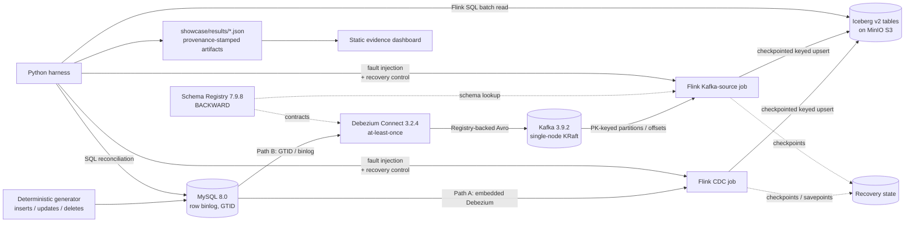

[English](README.md) | [简体中文](README.zh-CN.md)

# Exactly Once Stream — MySQL CDC → Flink → Iceberg

[](https://github.com/LucisZhang/exactly-once-drills/actions/workflows/ci.yml)

A single-node **reliability lab** with two certified ingress paths into the same
`Flink 1.20 → Apache Iceberg v2 (upsert)` correctness boundary: preserved direct
MySQL CDC (**Path A**) and an Avro-contract, Kafka-brokered path (**Path B**).

A streaming demo that works on the happy path proves nothing about exactly-once delivery.
Real failures happen around task processes, checkpoints, coordinators, savepoints, and sink
commits — so this lab **induces those failures on purpose** and then asks a narrow, checkable
question: after this specific failure and recovery path, do the MySQL source snapshot, the
Iceberg table snapshot, and the changelog event-ID sets still agree, row by row? Every claim
is backed by a committed, machine-checkable JSON artifact with full provenance (`run_id`,
`git_sha`, exact command, logs).

## Core architecture



The committed [Path A / Path B diagram](showcase/media/phase-b1-path-a-b.svg) and
[decision record](docs/adr-001-broker-cdc-registry.md) pin the same topology and component
choices.

## Verified claims

Claims are **gated**: a claim is added to
[`docs/resume-claims-after-verification.md`](docs/resume-claims-after-verification.md)
only after the phase that proves it has passed and produced auditable JSON under
[`showcase/results/`](showcase/results/).

| Claim | Evidence |
| --- | --- |
| Exactly-once final-state reconciliation across **five induced failure classes** — task crash, retained-checkpoint restore, JobManager restart, savepoint restore, and a deterministic checkpoint-complete sink-commit fault — with **zero snapshot diff and consistent event-ID audits** in every class. | [`showcase/results/eo_reconciliation.json`](showcase/results/eo_reconciliation.json) (run `20260711T035242Z-b518d211`), incident log in [`RUNBOOK.md`](RUNBOOK.md) |
| CDC correctness smoke: source-vs-Iceberg final-state parity including updates and deletes, changelog audit counts, and equality-delete file metadata evidence. | [`showcase/results/phase-1.2-cdc-smoke.json`](showcase/results/phase-1.2-cdc-smoke.json) |
| Iceberg small-file maintenance: `rewrite_data_files` + manifest rewrite compacted **48 data files to 2**, cut planned scan tasks 48 → 2, raised median file size 2,809 → 6,614.5 bytes, and lowered measured `planFiles()` latency 54.92 ms → 44.57 ms across seven repetitions. | [`showcase/results/iceberg_small_file_rewrite.json`](showcase/results/iceberg_small_file_rewrite.json), chart in [`showcase/media/`](showcase/media/) |
| Checkpoint behavior under load: real Prometheus-reporter metrics show max checkpoint duration rising **55 ms → 19,022 ms** under a deterministic input spike, max alignment time ~5 ms → 16,882 ms, one recorded checkpoint failure, backpressure appearing, and Iceberg commit lag growing to **320 events and recovering to zero**. | [`showcase/results/checkpoint_metrics.json`](showcase/results/checkpoint_metrics.json), chart in [`showcase/media/`](showcase/media/) |
| Broker ingress parity: the same deterministic 1,000-event, seed-17 workload through preserved Path A and Kafka Path B converged to the same Iceberg final-state digest with row-level diff `0`; the recorded Path B offsets have lag `0` and are linked to a completed Flink checkpoint and Iceberg snapshot IDs. | [`showcase/results/broker_parity.json`](showcase/results/broker_parity.json) (run `20260820T102311Z-5bbec087`), raw log in [`showcase/logs/phase-b1-broker-verify-20260820T101332Z.log`](showcase/logs/phase-b1-broker-verify-20260820T101332Z.log) |
| Avro contract enforcement: Schema Registry rejected an incompatible `event_id long → string` change with HTTP `409`, retained subject version `1`, and the old-schema pipeline advanced checkpoints and converged with lag `0` and row-level diff `0`. | [`showcase/results/schema_contract_drill.json`](showcase/results/schema_contract_drill.json), contract boundary in [`docs/data-contracts.md`](docs/data-contracts.md) |
| Kafka Path B failure drills: broker restart resumed from committed offsets; forced redelivery produced 36 audited duplicate occurrences but one row per key; correct keying preserved per-key order while a controlled mis-key probe exposed one ordering violation; one poison record was quarantined to a DLQ, repaired, and replayed; and fresh offset-zero and timestamp rebuilds both matched the original snapshot. Every certified final reconciliation had row-level diff `0`. | [`broker_restart_drill.json`](showcase/results/broker_restart_drill.json), [`duplicate_redelivery_drill.json`](showcase/results/duplicate_redelivery_drill.json), [`ordering_miskey_drill.json`](showcase/results/ordering_miskey_drill.json), [`poison_dlq_drill.json`](showcase/results/poison_dlq_drill.json), [`offset_replay_drill.json`](showcase/results/offset_replay_drill.json), incidents in [`RUNBOOK.md`](RUNBOOK.md) |
| Fixed Path B measurement: the 100,000-event seed-401 run recorded **1,791.665 events/s**, freshness p50/p95 **15.201 s / 20.614 s**, and five recovery observations from **24.456 s to 52.414 s**; every measured recovery ended at row-level diff `0`. These are single-run regression budgets, not availability commitments. | [`showcase/results/broker_slo.json`](showcase/results/broker_slo.json), interpretation and hardware in [`docs/SLO.md`](docs/SLO.md) |

**Scale honesty.** This remains a correctness lab with one bounded performance run, not a
production-capacity study. Path A uses exhaustive small-run diffs; Path B's only performance
statement is the fixed B4 workload on one dedicated VM. There is no terabyte-table, long-duration,
cross-cloud, multi-node HA, or availability commitment.

## Delivery-semantics chain


| Path | Delivery-semantics chain | Meaning and proof boundary |
| --- | --- | --- |
| **A — preserved direct CDC** | MySQL GTID/binlog → embedded Debezium in Flink CDC → Flink checkpoint/savepoint state → Iceberg v2 snapshot | No broker offset exists. The claim is final MySQL snapshot vs equality-delete-aware Iceberg snapshot reconciliation, supplemented by the changelog event-ID audit, across the five Path A drills. [`eo_reconciliation.json`](showcase/results/eo_reconciliation.json) is the proof. |
| **B — broker ingress** | MySQL GTID/binlog → standalone Debezium Connect (**at-least-once**) → Registry-backed Avro (`BACKWARD`) → Kafka partition offsets → checkpointed Flink Kafka source → Iceberg v2 keyed-upsert snapshot | Redelivery is possible before Flink, so correctness depends on primary-key keying, idempotent current-state upserts, and an audit-visible changelog. Each result links Kafka offsets ↔ a completed Flink checkpoint ↔ Iceberg snapshot IDs; parity is proved in [`broker_parity.json`](showcase/results/broker_parity.json). |

The Kafka record key is the MySQL `order_id` primary key. Kafka therefore preserves order for
one key inside its assigned topic partition; it does **not** provide total order across keys or
partitions. The controlled mis-key drill proved that a wrong Kafka key crosses that boundary and
must be rejected before main-topic admission
([evidence](showcase/results/ordering_miskey_drill.json)).

Schema Registry 7.9.8 is part of the `broker` profile with global `BACKWARD` compatibility.
Phase B2 uses Registry-backed Avro for Debezium key/value production and Flink Path B
consumption; the committed B1 parity artifact remains an immutable record of the earlier
JSON-wire run. In certified run `20260820T120104Z-7e40acd6`, the Registry rejected an
`event_id long -> string` value-schema mutation with HTTP `409`, kept the subject at version
`1`, and the old-schema pipeline remained live: checkpoint `5 -> 7`, Kafka lag `0`, the
post-rejection event was visible, and the final source/Iceberg row-level diff was `0`. See
[`showcase/results/schema_contract_drill.json`](showcase/results/schema_contract_drill.json) and
[`docs/data-contracts.md`](docs/data-contracts.md) for the contract boundary.

## Failure drill catalog — 10 classes

The count is exactly five original Path A failures plus five broker-specific Path B failures.
The incompatible-schema rejection is separately certified contract evidence and is not counted as
an eleventh failure class. The Path A evidence was re-captured on Apple Silicon
([run summary](docs/workstation-run/20260711T034018Z-local-mac/SUMMARY.md)); Path B was captured on
the dedicated CPU-only Linux VM recorded in each result.

| # | Path | Failure class | Certified outcome | Evidence |
| ---: | --- | --- | --- | --- |
| 1 | A | Task crash | Fixed-delay task restart; final snapshot diff `0`. | [result](showcase/results/eo_reconciliation.json) · [incident](RUNBOOK.md#phase-13---flink-task-crash) |
| 2 | A | Retained-checkpoint restore | Replacement job restored retained checkpoint; final diff `0`. | [result](showcase/results/eo_reconciliation.json) · [incident](RUNBOOK.md#phase-13---checkpoint-restore) |
| 3 | A | JobManager restart | Session job restored from latest checkpoint; final diff `0`. | [result](showcase/results/eo_reconciliation.json) · [incident](RUNBOOK.md#phase-21---jobmanager-restart) |
| 4 | A | Savepoint restore | Explicit savepoint restored into a replacement job; final diff `0`. | [result](showcase/results/eo_reconciliation.json) · [incident](RUNBOOK.md#phase-21---savepoint-restore) |
| 5 | A | Sink commit fault | One-shot checkpoint-complete callback failure recovered; final diff `0`. | [result](showcase/results/eo_reconciliation.json) · [incident](RUNBOOK.md#phase-21---sink-commit-fault) |
| 6 | B | Kafka broker restart | Existing Flink job resumed from committed offsets; lag and final diff `0`. | [result](showcase/results/broker_restart_drill.json) · [incident](RUNBOOK.md#phase-b3---kafka-broker-restart-mid-stream) |
| 7 | B | Duplicate redelivery | 36 duplicates were audited; keyed current state stayed unique and diff `0`. | [result](showcase/results/duplicate_redelivery_drill.json) · [incident](RUNBOOK.md#phase-b3---forced-duplicate-redelivery) |
| 8 | B | Out-of-order / mis-keying | One non-monotonic transition was detected and rejected before main admission. | [result](showcase/results/ordering_miskey_drill.json) · [incident](RUNBOOK.md#phase-b3---out-of-order-mis-keying-boundary) |
| 9 | B | Poison message → DLQ | One record was quarantined with metadata, repaired with registered Avro, replayed, and reconciled to diff `0`. | [result](showcase/results/poison_dlq_drill.json) · [incident](RUNBOOK.md#phase-b3---poison-message-quarantine-and-repair) |
| 10 | B | Offset-zero / timestamp replay | Both fresh rebuilds matched the original row-for-row and by digest. | [result](showcase/results/offset_replay_drill.json) · [incident](RUNBOOK.md#phase-b3---offset-zero-and-timestamp-replay) |

## Production story

The upgrade failed in useful, preserved ways before certification: the first assigned host was a
[restricted container without Docker or the required capabilities](showcase/logs/phase-b1-remote-preflight-blocked.log),
then [Docker Hub timed out during image resolution](showcase/logs/phase-b1-broker-up-20260820T094359Z.log).
The Avro cutover exposed both a [missing Python Avro dependency](showcase/logs/phase-b2-broker-verify-20260820T112758Z.log)
and a [terminal Flink job before baseline convergence](showcase/logs/phase-b2-broker-verify-20260820T114149Z.log);
the certified run records the resulting Jackson/Avro pins
([B2 evidence](showcase/results/schema_contract_drill.json)). A reconnect-style rerun also
relaunched completed parity work until the append-only fence stopped it
([failure log](showcase/logs/phase-b1-broker-verify-20260820T102412Z.log)), which led to completed-run
reuse in the tmux wrapper. On the final dedicated VM, the project measured the fixed B4 workload
and five recovery paths ([B4 evidence](showcase/results/broker_slo.json)); the tradeoff is explicit:
single-node Kafka KRaft and at-least-once Debezium are accepted for a reproducible lab, while
keyed idempotence, reconciliation, and preserved failure evidence carry the correctness story—not
HA claims. The measured memory envelope and locked component choices are in the
[ADR](docs/adr-001-broker-cdc-registry.md).

## How the evidence works

- **Correctness-safe reading.** Iceberg v2 upsert tables contain equality deletes; pyiceberg
  is not a correctness reader for them. The lab splits the paths: `make sql-iceberg` reads
  data through **Flink SQL batch**; `make sql-iceberg-meta` uses pyiceberg for **metadata
  only** (files, manifests, snapshots).
- **Results contract.** Every artifact must carry `run_id`, `git_sha`, `started_at`,
  `finished_at`, `stack_versions`, `command`, and `logs`
  ([contract](showcase/results/README.md)); the dashboard sync step validates this before an
  artifact is publishable.
- **Incident log.** [`RUNBOOK.md`](RUNBOOK.md) records each induced failure as an incident:
  trigger, observed symptom, detection/recovery commands, validation, artifact links.

## Evidence dashboard (deployable slice)

The heavy pipeline is not a public live demo. The deployable slice is a **static dashboard**
([`dashboard/`](dashboard/)) built over the exported result JSON — it renders the artifacts
and their provenance and calls no backend.

```bash
make dashboard-build     # validates results contract, then vite build
make dashboard-preview   # serve the built dashboard locally
```


The public portfolio adds an interactive captured-run replay over the same JSON package.
Open the public [Portfolio Phase 2 Review](https://portfolio-site-gpt-review.vercel.app/engineering/p1-reliability-lab).
The isolated Review deployment requires no Vercel login or query secret.

## Local lite mode

On a space-constrained laptop, use the no-Docker path:

```bash
make local-verify
```

This runs harness unit tests, lint/type checks, Maven verification, and the static dashboard
build with results-contract validation. It is the recommended local command for reviewing the
project. It does **not** reproduce the live Flink/MySQL/Iceberg failure run on demand.

## Remote heavy reproduction path

Pinned toolchain: Java 11 (Temurin), Maven 3.9, Python 3.11, Node 20
(see [`docs/version-matrix.md`](docs/version-matrix.md) and `.tool-versions`).
Stack: Flink 1.20.4 + Flink CDC 3.6.0, Iceberg 1.10.0, MySQL 8.0.36 (row binlog, GTID, full
row images), MinIO, PyIceberg 0.9.1.

The Mac remains a light-path and Git/evidence machine. Docker runs on the dedicated Linux VM
through disconnect-safe tmux wrappers. No `.git`, `.env`, SSH agent, token, or Git credential
is synced.

```bash
export P1_REMOTE_ROOT='exactly-once-workstation:/root/autodl-tmp/exactly-once-drills'
make sync-up P1_REMOTE_ROOT="$P1_REMOTE_ROOT"
make remote-broker-up P1_REMOTE_ROOT="$P1_REMOTE_ROOT" \
  ARGS="--phase failures --fresh"
make remote-broker-verify P1_REMOTE_ROOT="$P1_REMOTE_ROOT" \
  ARGS="--failure broker-restart"
make sync-down P1_REMOTE_ROOT="$P1_REMOTE_ROOT"
```

Repeat the fresh guarded B3 pair for `duplicate-redelivery`, `mis-keying`, `poison-dlq`, and
`offset-replay`. The fixed B4 measurement uses its separate phase key and exact certified
workload:

```bash
make remote-broker-up P1_REMOTE_ROOT="$P1_REMOTE_ROOT" \
  ARGS="--phase slo --fresh"
make remote-broker-verify P1_REMOTE_ROOT="$P1_REMOTE_ROOT" \
  ARGS="--phase slo --events 100000 --seed 401 --batch-size 1000 \
  --fault-after-events 25000 --outage-seconds 5"
```

Run `make sync-up` before each approved loop and `make sync-down` afterward; see the remote
execution guide for the full B1–B4 sequences.

Every new remote launch records load average and refuses to run above half the logical CPU
count. On a host with `nvidia-smi`, it also records GPU state and refuses active compute;
on the dedicated CPU-only VM, an absent binary is explicitly recorded and skipped.
`make preflight-broker` also checks disk, Docker, and at least 16 GiB total / 8 GiB available
RAM before selecting Kafka KRaft.
See [`docs/broker-remote-execution.md`](docs/broker-remote-execution.md) for reconnect and
append-only sync behavior.

The heavy path should run on a workstation with at least 40 GiB free disk and enough Docker
memory for Flink, MySQL, MinIO, and the Iceberg catalog. The Makefile refuses to start heavy
targets when the repository volume has less than 25 GiB free or Docker does not respond
promptly. See
[`docs/local-lite-and-workstation.md`](docs/local-lite-and-workstation.md) for the full split
between laptop-friendly verification and workstation reproduction.

Lightweight checks (no Docker): `make test`, `make lint` (ruff, black, mypy, Maven verify),
`make dashboard-build`, or the combined `make local-verify`.

## CI

GitHub Actions runs the light paths on every push: Python lint + unit tests, the Flink job
Maven build, and the dashboard build with results-contract validation. The heavy Docker
integration (`make eo-verify`, `make test-cdc`) is intentionally **not** in CI — it runs
manually on a single node and its outputs are committed as auditable artifacts.

## Scope and status

- Verified through **Phase 2.3** and broker upgrade **Phases B1–B4**; **Phase B5** closes the
  documentation without generating a new result. B1 remains bounded to
  [`showcase/results/broker_parity.json`](showcase/results/broker_parity.json); B2 is bounded to
  Registry rejection plus uninterrupted old-schema flow in
  [`showcase/results/schema_contract_drill.json`](showcase/results/schema_contract_drill.json).
  B3 is bounded to the five committed drill artifacts linked above. B4 is bounded to the one
  fixed-workload [`broker_slo.json`](showcase/results/broker_slo.json) run and the regression-budget
  interpretation in [`docs/SLO.md`](docs/SLO.md); it is not an HA or production-capacity claim.
- **StarRocks (M3+) has not been started** — the `olap` compose profile,
  serving-table imports, and the compaction benchmark are reserved future work.
- Single-node Docker Compose only; no cloud-production, multi-node, or GPU claim.
- Local laptops are treated as evidence-review machines, not the default heavy reproduction
  environment. Preserve workstation evidence before making any "reproduced on demand" claim.

## Rights

No open-source license is currently granted; all rights reserved. Flink, Iceberg, Debezium,
MySQL, and MinIO retain their own upstream licenses.
