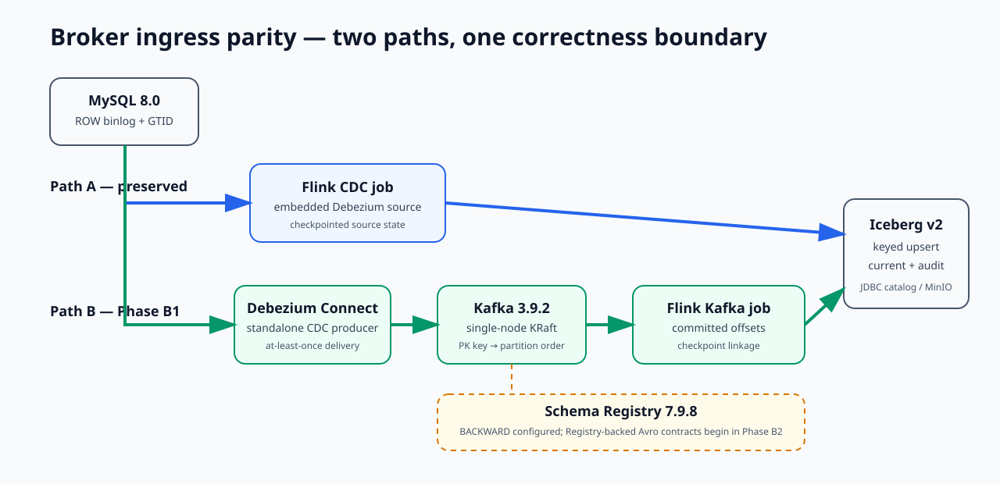

# exactly-once-drills

[](https://github.com/LucisZhang/exactly-once-drills/actions/workflows/ci.yml)

A single-node **reliability lab** with two certified ingress paths into the same
`Flink 1.20 → Apache Iceberg v2 (upsert)` correctness boundary: preserved direct
MySQL CDC (**Path A**) and an Avro-contract, Kafka-brokered path (**Path B**).

> 单节点可靠性实验室：保留的 MySQL 直连 CDC（**Path A**）与走 Avro contract、经 Kafka 中转的（**Path B**）两条入口，最终都落到同一条 `Flink 1.20 → Apache Iceberg v2 (upsert)` 正确性边界。



## Quickstart · 快速开始

```bash
make local-verify
```

This no-Docker path runs unit tests, lint and type checks, Maven verification, and the static
dashboard build with results-contract validation. It reviews committed runs; it does not
reproduce the Flink/MySQL/Iceberg failure drills on demand.

> 这套不依赖 Docker 的检查流程会跑单测、静态检查、Maven 验证和面板构建；它只审阅已提交结果，不会现场重放故障。

A streaming demo that works on the happy path proves nothing about exactly-once delivery.
Real failures happen around task processes, checkpoints, coordinators, savepoints, and sink
commits — so this lab **induces those failures on purpose** and then asks a narrow, checkable
question: after this specific failure and recovery path, do the MySQL source snapshot, the
Iceberg table snapshot, and the changelog event-ID sets still agree, row by row? Every claim
is backed by a committed, machine-checkable JSON artifact with full provenance (`run_id`,
`git_sha`, exact command, logs).

> 顺利跑通不代表 exactly-once 成立。这里会主动注入任务崩溃、JobManager 重启和 Sink 提交故障，并演练 checkpoint/savepoint 恢复；随后逐行核对 MySQL、Iceberg 与 changelog 事件 ID，每项结论都能追到 JSON、命令和日志。

## Core architecture · 核心架构


The committed [Path A / Path B diagram](showcase/media/phase-b1-path-a-b.svg) and
[decision record](docs/adr-001-broker-cdc-registry.md) pin the same topology and component
choices.

> 架构图与 ADR 固定了同一套拓扑和组件选择，避免结果与实现各说各话。

## Verified claims · 已验证结果

Claims are **gated**: a claim is added to
[`docs/resume-claims-after-verification.md`](docs/resume-claims-after-verification.md)
only after the phase that proves it has passed and produced auditable JSON under
[`showcase/results/`](showcase/results/).

> 只有阶段验收通过并产出可审计 JSON，对应结论才会进入简历声明清单。

| Claim | Proof |
| --- | --- |
| Exactly-once final-state reconciliation across **five induced failure classes** — task crash, retained-checkpoint restore, JobManager restart, savepoint restore, and a deterministic checkpoint-complete sink-commit fault — with **zero snapshot diff and consistent event-ID audits** in every class. | [`showcase/results/eo_reconciliation.json`](showcase/results/eo_reconciliation.json) (run `20260711T035242Z-b518d211`), incident log in [`RUNBOOK.md`](RUNBOOK.md) |
| CDC correctness smoke: source-vs-Iceberg final-state parity including updates and deletes, changelog audit counts, and equality-delete file metadata receipts. | [`showcase/results/phase-1.2-cdc-smoke.json`](showcase/results/phase-1.2-cdc-smoke.json) |
| Iceberg small-file maintenance: `rewrite_data_files` + manifest rewrite compacted **48 data files to 2**, cut planned scan tasks 48 → 2, raised median file size 2,809 → 6,614.5 bytes, and lowered measured `planFiles()` latency 54.92 ms → 44.57 ms across seven repetitions. | [`showcase/results/iceberg_small_file_rewrite.json`](showcase/results/iceberg_small_file_rewrite.json), chart in [`showcase/media/`](showcase/media/) |
| Checkpoint behavior under load: real Prometheus-reporter metrics show max checkpoint duration rising **55 ms → 19,022 ms** under a deterministic input spike, max alignment time ~5 ms → 16,882 ms, one recorded checkpoint failure, backpressure appearing, and Iceberg commit lag growing to **320 events and recovering to zero**. | [`showcase/results/checkpoint_metrics.json`](showcase/results/checkpoint_metrics.json), chart in [`showcase/media/`](showcase/media/) |
| Broker ingress parity: the same deterministic 1,000-event, seed-17 workload through preserved Path A and Kafka Path B converged to the same Iceberg final-state digest with row-level diff `0`; the recorded Path B offsets have lag `0` and are linked to a completed Flink checkpoint and Iceberg snapshot IDs. | [`showcase/results/broker_parity.json`](showcase/results/broker_parity.json) (run `20260820T102311Z-5bbec087`), raw log in [`showcase/logs/phase-b1-broker-verify-20260820T101332Z.log`](showcase/logs/phase-b1-broker-verify-20260820T101332Z.log) |
| Avro contract enforcement: Schema Registry rejected an incompatible `event_id long → string` change with HTTP `409`, retained subject version `1`, and the old-schema pipeline advanced checkpoints and converged with lag `0` and row-level diff `0`. | [`showcase/results/schema_contract_drill.json`](showcase/results/schema_contract_drill.json), contract boundary in [`docs/data-contracts.md`](docs/data-contracts.md) |
| Kafka Path B failure drills: broker restart resumed from committed offsets; forced redelivery produced 36 audited duplicate occurrences but one row per key; correct keying preserved per-key order while a controlled mis-key probe exposed one ordering violation; one poison record was quarantined to a DLQ, repaired, and replayed; and fresh offset-zero and timestamp rebuilds both matched the original snapshot. Every certified final reconciliation had row-level diff `0`. | [`broker_restart_drill.json`](showcase/results/broker_restart_drill.json), [`duplicate_redelivery_drill.json`](showcase/results/duplicate_redelivery_drill.json), [`ordering_miskey_drill.json`](showcase/results/ordering_miskey_drill.json), [`poison_dlq_drill.json`](showcase/results/poison_dlq_drill.json), [`offset_replay_drill.json`](showcase/results/offset_replay_drill.json), incidents in [`RUNBOOK.md`](RUNBOOK.md) |
| Fixed Path B measurement: the 100,000-event seed-401 run recorded **1,791.665 events/s**, freshness p50/p95 **15.201 s / 20.614 s**, and five recovery observations from **24.456 s to 52.414 s**; every measured recovery ended at row-level diff `0`. These are single-run regression budgets, not availability commitments. | [`showcase/results/broker_slo.json`](showcase/results/broker_slo.json), interpretation and hardware in [`docs/SLO.md`](docs/SLO.md) |

<sub>Recorded results and source artifacts · 实测结果与来源文件</sub>

**Applicability boundary.** This remains a correctness lab with one bounded performance run, not a
production-capacity study. Path A uses exhaustive small-run diffs; Path B's only performance
statement is the fixed B4 workload on one dedicated VM. There is no terabyte-table, long-duration,
cross-cloud, multi-node HA, or availability commitment.

> **这套结果的适用边界。** Path A 做小规模逐行对账；Path B 的性能数字只来自一台专用 VM 上的一次固定 B4 运行，不代表 TB 级、长周期、跨云、多节点 HA 或可用性承诺。

## Delivery-semantics chain · 投递语义链

| Path | Delivery-semantics chain | Meaning and proof boundary |
| --- | --- | --- |
| **A — preserved direct CDC** | MySQL GTID/binlog → embedded Debezium in Flink CDC → Flink checkpoint/savepoint state → Iceberg v2 snapshot | No broker offset exists. The claim is final MySQL snapshot vs equality-delete-aware Iceberg snapshot reconciliation, supplemented by the changelog event-ID audit, across the five Path A drills. [`eo_reconciliation.json`](showcase/results/eo_reconciliation.json) is the proof. |
| **B — broker ingress** | MySQL GTID/binlog → standalone Debezium Connect (**at-least-once**) → Registry-backed Avro (`BACKWARD`) → Kafka partition offsets → checkpointed Flink Kafka source → Iceberg v2 keyed-upsert snapshot | Redelivery is possible before Flink, so correctness depends on primary-key keying, idempotent current-state upserts, and an audit-visible changelog. Each result links Kafka offsets ↔ a completed Flink checkpoint ↔ Iceberg snapshot IDs; parity is proved in [`broker_parity.json`](showcase/results/broker_parity.json). |

<sub>End-to-end semantics and proof boundaries · 端到端语义与验证边界</sub>

The Kafka record key is the MySQL `order_id` primary key. Kafka therefore preserves order for
one key inside its assigned topic partition; it does **not** provide total order across keys or
partitions. The controlled mis-key drill proved that a wrong Kafka key crosses that boundary and
must be rejected before main-topic admission
([result](showcase/results/ordering_miskey_drill.json)).

> Kafka 只保证同一 key 在分区内有序；key 配错后，这项顺序保证就不再成立，所以 mis-key 记录必须在进入主 topic 前被拒绝。

Schema Registry 7.9.8 is part of the `broker` profile with global `BACKWARD` compatibility.
Phase B2 uses Registry-backed Avro for Debezium key/value production and Flink Path B
consumption; the committed B1 parity artifact remains an immutable record of the earlier
JSON-wire run. In certified run `20260820T120104Z-7e40acd6`, the Registry rejected an
`event_id long -> string` value-schema mutation with HTTP `409`, kept the subject at version
`1`, and the old-schema pipeline remained live: checkpoint `5 -> 7`, Kafka lag `0`, the
post-rejection event was visible, and the final source/Iceberg row-level diff was `0`. See
[`showcase/results/schema_contract_drill.json`](showcase/results/schema_contract_drill.json) and
[`docs/data-contracts.md`](docs/data-contracts.md) for the contract boundary.

> Schema Registry 7.9.8 属于 `broker` profile，全局兼容性为 `BACKWARD`。Phase B2 让 Debezium 的 key/value 生产与 Flink Path B 消费都走 Registry 托管的 Avro；已提交的 B1 parity 产物保留为更早那次 JSON-wire 运行的不可变记录。在认证运行 `20260820T120104Z-7e40acd6` 中，Registry 以 HTTP `409` 拒绝了 `event_id long -> string` 的 value schema 变更，subject 保持在版本 `1`，旧 schema 的管道全程在线：checkpoint 从 `5` 推进到 `7`，Kafka lag 为 `0`，被拒之后写入的事件仍然可见，最终 source 与 Iceberg 的行级 diff 为 `0`。契约边界见 [`showcase/results/schema_contract_drill.json`](showcase/results/schema_contract_drill.json) 与 [`docs/data-contracts.md`](docs/data-contracts.md)。

## Failure drill catalog · 10 类故障演练

The count is exactly five original Path A failures plus five broker-specific Path B failures.
The incompatible-schema rejection is separately certified contract proof and is not counted as
an eleventh failure class. The Path A run was re-captured on Apple Silicon
([run summary](docs/workstation-run/20260711T034018Z-local-mac/SUMMARY.md)); Path B was captured on
the dedicated CPU-only Linux VM recorded in each result.

> 10 类故障由 Path A 与 Path B 各五类组成；schema 拒绝是另行认证的契约证明，不计入这 10 类。Path A 在 Apple Silicon 上重新采集，Path B 来自结果文件所记录的专用 CPU-only Linux VM。

| # | Path | Failure class | Certified outcome | Proof |
| ---: | --- | --- | --- | --- |
| 1 | A | Task crash | Fixed-delay task restart; final snapshot diff `0`. | [result](showcase/results/eo_reconciliation.json) · [incident](RUNBOOK.md#phase-13---flink-task-crash) |
| 2 | A | Retained-checkpoint restore | Replacement job restored retained checkpoint; final diff `0`. | [result](showcase/results/eo_reconciliation.json) · [incident](RUNBOOK.md#phase-13---checkpoint-restore) |
| 3 | A | JobManager restart | Session job restored from latest checkpoint; final diff `0`. | [result](showcase/results/eo_reconciliation.json) · [incident](RUNBOOK.md#phase-21---jobmanager-restart) |
| 4 | A | Savepoint restore | Explicit savepoint restored into a replacement job; final diff `0`. | [result](showcase/results/eo_reconciliation.json) · [incident](RUNBOOK.md#phase-21---savepoint-restore) |
| 5 | A | Sink commit fault | One-shot checkpoint-complete callback failure recovered; final diff `0`. | [result](showcase/results/eo_reconciliation.json) · [incident](RUNBOOK.md#phase-21---sink-commit-fault) |
| 6 | B | Kafka broker restart | Existing Flink job resumed from committed offsets; lag and final diff `0`. | [result](showcase/results/broker_restart_drill.json) · [incident](RUNBOOK.md#phase-b3---kafka-broker-restart-mid-stream) |
| 7 | B | Duplicate redelivery | 36 duplicates were audited; keyed current state stayed unique and diff `0`. | [result](showcase/results/duplicate_redelivery_drill.json) · [incident](RUNBOOK.md#phase-b3---forced-duplicate-redelivery) |
| 8 | B | Out-of-order / mis-keying | One non-monotonic transition was detected and rejected before main admission. | [result](showcase/results/ordering_miskey_drill.json) · [incident](RUNBOOK.md#phase-b3---out-of-order-mis-keying-boundary) |
| 9 | B | Poison message → DLQ | One record was quarantined with metadata, repaired with registered Avro, replayed, and reconciled to diff `0`. | [result](showcase/results/poison_dlq_drill.json) · [incident](RUNBOOK.md#phase-b3---poison-message-quarantine-and-repair) |
| 10 | B | Offset-zero / timestamp replay | Both fresh rebuilds matched the original row-for-row and by digest. | [result](showcase/results/offset_replay_drill.json) · [incident](RUNBOOK.md#phase-b3---offset-zero-and-timestamp-replay) |

<sub>Five Path A failures plus five broker-specific Path B failures · Path A 与 Path B 各五类故障</sub>

## Engineering tradeoffs · 工程实战与取舍

The upgrade failed in useful, preserved ways before certification: the first assigned host was a
[restricted container without Docker or the required capabilities](showcase/logs/phase-b1-remote-preflight-blocked.log),
then [Docker Hub timed out during image resolution](showcase/logs/phase-b1-broker-up-20260820T094359Z.log).
The Avro cutover exposed both a [missing Python Avro dependency](showcase/logs/phase-b2-broker-verify-20260820T112758Z.log)
and a [terminal Flink job before baseline convergence](showcase/logs/phase-b2-broker-verify-20260820T114149Z.log);
the certified run records the resulting Jackson/Avro pins
([B2 result](showcase/results/schema_contract_drill.json)). A reconnect-style rerun also
relaunched completed parity work until the append-only fence stopped it
([failure log](showcase/logs/phase-b1-broker-verify-20260820T102412Z.log)), which led to completed-run
reuse in the tmux wrapper. On the final dedicated VM, the project measured the fixed B4 workload
and five recovery paths ([B4 result](showcase/results/broker_slo.json)); the tradeoff is explicit:
single-node Kafka KRaft and at-least-once Debezium are accepted for a reproducible lab, while
keyed idempotence, reconciliation, and preserved failed-run artifacts carry the correctness story—not
HA claims. The measured memory envelope and locked component choices are in the
[ADR](docs/adr-001-broker-cdc-registry.md).

> 认证前先后遇到受限主机、Docker Hub 超时、Avro 依赖缺失、Flink 提前失败和重复启动。修复后，单节点 Kafka KRaft 与 at-least-once Debezium 仍是刻意保留的取舍；正确性靠主键幂等、对账和失败记录来验证，不借 HA 叙事拔高。

## Verification model · 验证方式

- **Correctness-safe reading.** Iceberg v2 upsert tables contain equality deletes; pyiceberg
  is not a correctness reader for them. The lab splits the paths: `make sql-iceberg` reads
  data through **Flink SQL batch**; `make sql-iceberg-meta` uses pyiceberg for **metadata
  only** (files, manifests, snapshots).

> - **正确性读取路径。** Iceberg v2 的 upsert 表里存在 equality delete，pyiceberg 不能作为它的正确性读取器。因此本实验把两条路径拆开：`make sql-iceberg` 通过 **Flink SQL batch** 读数据；`make sql-iceberg-meta` 只用 pyiceberg 读 **metadata**（files、manifests、snapshots）。

- **Results contract.** Every artifact must carry `run_id`, `git_sha`, `started_at`,
  `finished_at`, `stack_versions`, `command`, and `logs`
  ([contract](showcase/results/README.md)); the dashboard sync step validates this before an
  artifact is publishable.

> - **结果契约。** 每份产物都必须带上 `run_id`、`git_sha`、`started_at`、`finished_at`、`stack_versions`、`command` 和 `logs`（[契约](showcase/results/README.md)）；面板同步步骤会先校验这些字段，产物才允许发布。

- **Incident log.** [`RUNBOOK.md`](RUNBOOK.md) records each induced failure as an incident:
  trigger, observed symptom, detection/recovery commands, validation, artifact links.

> - **事故日志。** [`RUNBOOK.md`](RUNBOOK.md) 把每一次注入的故障按事故记录：触发方式、观察到的现象、检测与恢复命令、验证过程、产物链接。

## Results dashboard · 结果面板

The heavy pipeline is not a public live demo. The deployable slice is a **static dashboard**
([`dashboard/`](dashboard/)) built over the exported result JSON — it renders the artifacts
and their provenance and calls no backend.

> 重负载管道不做公开在线 demo；可部署部分是静态结果面板，只读取导出的 JSON，不连接后端。

```bash
make dashboard-build     # validates results contract, then vite build
make dashboard-preview   # serve the built dashboard locally
```


The public portfolio adds an interactive captured-run replay over the same JSON package.
Open the public [project page](https://xiangguozhang.com/engineering/exactly-once-drills).
The isolated Review deployment requires no Vercel login or query secret.

> 公开项目页在同一份 JSON 上增加交互回放，不需要 Vercel 登录或查询密钥。

## Local lite mode · 本地轻量模式

On a space-constrained laptop, use the no-Docker path:

> 笔记本磁盘吃紧时，走不依赖 Docker 的这条路径：

```bash
make local-verify
```

This runs harness unit tests, lint/type checks, Maven verification, and the static dashboard
build with results-contract validation. It is the recommended local command for reviewing the
project. It does **not** reproduce the live Flink/MySQL/Iceberg failure run on demand.

> 这条命令适合本地审阅，会跑单测、静态检查、Maven 验证和面板构建，但不会重放真实的 Flink/MySQL/Iceberg 故障。

## Remote heavy reproduction · 远端复现

Pinned toolchain: Java 11 (Temurin), Maven 3.9, Python 3.11, Node 20
(see [`docs/version-matrix.md`](docs/version-matrix.md) and `.tool-versions`).
Stack: Flink 1.20.4 + Flink CDC 3.6.0, Iceberg 1.10.0, MySQL 8.0.36 (row binlog, GTID, full
row images), MinIO, PyIceberg 0.9.1.

> 工具链已固定：Java 11（Temurin）、Maven 3.9、Python 3.11、Node 20（见 [`docs/version-matrix.md`](docs/version-matrix.md) 与 `.tool-versions`）。技术栈为 Flink 1.20.4 + Flink CDC 3.6.0、Iceberg 1.10.0、MySQL 8.0.36（row binlog、GTID、full row image）、MinIO、PyIceberg 0.9.1。

The Mac remains a light-path and Git/artifact machine. Docker runs on the dedicated Linux VM
through disconnect-safe tmux wrappers. No `.git`, `.env`, SSH agent, token, or Git credential
is synced.

> Mac 只负责轻量检查和结果提交；Docker 在专用 Linux VM 上运行，tmux 保证断连后任务继续，凭据和仓库元数据不上传。

```bash
export P1_REMOTE_ROOT='exactly-once-workstation:/root/autodl-tmp/exactly-once-drills'
make sync-up P1_REMOTE_ROOT="$P1_REMOTE_ROOT"
make remote-broker-up P1_REMOTE_ROOT="$P1_REMOTE_ROOT" \
  ARGS="--phase failures --fresh"
make remote-broker-verify P1_REMOTE_ROOT="$P1_REMOTE_ROOT" \
  ARGS="--failure broker-restart"
make sync-down P1_REMOTE_ROOT="$P1_REMOTE_ROOT"
```

Repeat the fresh guarded B3 pair for `duplicate-redelivery`, `mis-keying`, `poison-dlq`, and
`offset-replay`. The fixed B4 measurement uses its separate phase key and exact certified
workload:

> `duplicate-redelivery`、`mis-keying`、`poison-dlq`、`offset-replay` 这四类故障，按同样的 fresh guarded 方式各跑一对 B3。固定的 B4 测量使用独立的 phase key 和认证时的精确负载：

```bash
make remote-broker-up P1_REMOTE_ROOT="$P1_REMOTE_ROOT" \
  ARGS="--phase slo --fresh"
make remote-broker-verify P1_REMOTE_ROOT="$P1_REMOTE_ROOT" \
  ARGS="--phase slo --events 100000 --seed 401 --batch-size 1000 \
  --fault-after-events 25000 --outage-seconds 5"
```

Run `make sync-up` before each approved loop and `make sync-down` afterward; see the remote
execution guide for the full B1–B4 sequences.

> 每一轮获批的运行前先执行 `make sync-up`，结束后执行 `make sync-down`；完整的 B1–B4 序列见远端执行指南。

Every new remote launch records load average and refuses to run above half the logical CPU
count. On a host with `nvidia-smi`, it also records GPU state and refuses active compute;
on the dedicated CPU-only VM, an absent binary is explicitly recorded and skipped.
`make preflight-broker` also checks disk, Docker, and at least 16 GiB total / 8 GiB available
RAM before selecting Kafka KRaft.
See [`docs/broker-remote-execution.md`](docs/broker-remote-execution.md) for reconnect and
append-only sync behavior.

> 每次远端启动都会记录 load average，并在负载高于逻辑 CPU 核数一半时拒绝运行。宿主机上存在 `nvidia-smi` 时还会记录 GPU 状态并拒绝在有计算任务时运行；在这台 CPU-only 专用 VM 上，缺少该命令会被明确记录并跳过。`make preflight-broker` 还会在选定 Kafka KRaft 前检查磁盘、Docker 以及至少 16 GiB 总内存 / 8 GiB 可用内存。重连与 append-only 同步行为见 [`docs/broker-remote-execution.md`](docs/broker-remote-execution.md)。

The heavy path should run on a workstation with at least 40 GiB free disk and enough Docker
memory for Flink, MySQL, MinIO, and the Iceberg catalog. The Makefile refuses to start heavy
targets when the repository volume has less than 25 GiB free or Docker does not respond
promptly. See
[`docs/local-lite-and-workstation.md`](docs/local-lite-and-workstation.md) for the full split
between laptop-friendly verification and workstation reproduction.

> 重负载路径需要一台至少 40 GiB 可用磁盘的工作站，且 Docker 内存足以同时跑 Flink、MySQL、MinIO 和 Iceberg catalog。仓库所在卷可用空间低于 25 GiB、或 Docker 响应不及时，Makefile 会直接拒绝启动重负载 target。笔记本侧验证与工作站侧复现的完整分工见 [`docs/local-lite-and-workstation.md`](docs/local-lite-and-workstation.md)。

Lightweight checks (no Docker): `make test`, `make lint` (ruff, black, mypy, Maven verify),
`make dashboard-build`, or the combined `make local-verify`.

> 不依赖 Docker 的轻量检查：`make test`、`make lint`（ruff、black、mypy、Maven verify）、`make dashboard-build`，或者一次跑完的 `make local-verify`。

## CI · 持续集成

GitHub Actions runs the light paths on every push: Python lint + unit tests, the Flink job
Maven build, and the dashboard build with results-contract validation. The heavy Docker
integration (`make eo-verify`, `make test-cdc`) is intentionally **not** in CI — it runs
manually on a single node and its outputs are committed as auditable artifacts.

> GitHub Actions 在每次 push 上只跑轻量路径：Python lint 与单测、Flink job 的 Maven 构建，以及带结果契约校验的面板构建。重负载 Docker 集成（`make eo-verify`、`make test-cdc`）**刻意不进 CI**——它在单节点上手工运行，输出以可审计产物的形式提交入库。

## Scope and status · 范围与状态

- **Verified coverage** — Through **Phase 2.3** and broker upgrade **Phases B1–B4**; **Phase B5** closes the
  documentation without generating a new result. B1 remains bounded to
  [`showcase/results/broker_parity.json`](showcase/results/broker_parity.json); B2 is bounded to
  Registry rejection plus uninterrupted old-schema flow in
  [`showcase/results/schema_contract_drill.json`](showcase/results/schema_contract_drill.json).
  B3 is bounded to the five committed drill artifacts linked above. B4 is bounded to the one
  fixed-workload [`broker_slo.json`](showcase/results/broker_slo.json) run and the regression-budget
  interpretation in [`docs/SLO.md`](docs/SLO.md); it is not an HA or production-capacity claim.<br>
  当前结果覆盖 Phase 2.3 与 B1–B4；B5 仅完成文档收尾，各阶段边界以上述结果文件为准。
- **StarRocks (M3+) has not been started** — The `olap` compose profile,
  serving-table imports, and the compaction benchmark are reserved future work.<br>
  StarRocks 尚未启动，服务表导入与 compaction benchmark 仍是后续工作。
- **Deployment boundary** — Single-node Docker Compose only; no cloud-production, multi-node, or GPU claim.<br>
  当前只验证单节点 Docker Compose，不包含云上生产环境、多节点或 GPU。
- **Laptop boundary** — Local laptops are artifact-review machines, not the default heavy reproduction
  environment. Preserve workstation run artifacts before making any "reproduced on demand" claim.<br>
  笔记本只审阅已提交结果；声称“可按需复现”前，必须先保留工作站运行记录。

Engineering decisions and phase logs live in [docs/engineering-log/](docs/engineering-log/).

> 工程决策与阶段日志统一放在 `docs/engineering-log/`。

## Rights

Original code and text in this repository are released under the MIT License (see
[`LICENSE`](LICENSE)). Flink, Iceberg, Debezium, MySQL, and MinIO retain their own upstream
licenses.

> 本仓库的原创代码与文本以 MIT License 发布（见 [`LICENSE`](LICENSE)）。Flink、Iceberg、Debezium、MySQL 与 MinIO 仍受各自上游许可证约束。
