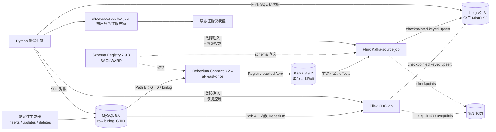

[English](README.md) | [简体中文](README.zh-CN.md)

# exactly-once-drills

[](https://github.com/LucisZhang/exactly-once-drills/actions/workflows/ci.yml)

这是一个单节点的**可靠性实验室**，包含两条进入同一
`Flink 1.20 → Apache Iceberg v2（upsert）` 正确性边界的已认证入口：保留的
MySQL 直连 CDC（**Path A**），以及带 Avro 契约、经 Kafka broker 的 **Path B**。

一个只在顺利路径（happy path）上能跑通的流式演示，无法证明任何关于精确一次
（exactly-once）投递的结论。真实故障发生在任务进程、检查点（checkpoint）、协调器
（coordinator）、保存点（savepoint）和 Sink 提交附近——因此本实验室**有意注入这些故障**，
然后提出一个狭窄且可检验的问题：在这次特定的故障与恢复路径之后，MySQL 源端快照、
Iceberg 表快照以及 changelog 事件 ID 集合是否仍然逐行一致？每一项声明都由已提交、
可机器校验的 JSON 证据产物支撑，并带有完整出处信息（`run_id`、`git_sha`、确切命令、日志）。

## 核心架构



已提交的 [Path A / Path B 架构图](showcase/media/phase-b1-path-a-b.svg)与
[决策记录](docs/adr-001-broker-cdc-registry.md)固定了同一套拓扑与组件选择。

## 已验证的声明

声明采用**门禁式（gated）**规则：只有当证明某项声明的阶段通过、并在
[`showcase/results/`](showcase/results/) 下产出可审计的 JSON 之后，该声明才会被加入
[`docs/resume-claims-after-verification.md`](docs/resume-claims-after-verification.md)。

| 声明 | 证据 |
| --- | --- |
| 跨**五类受控注入故障**的精确一次最终状态对账——任务崩溃、保留检查点恢复、JobManager 重启、保存点恢复，以及确定性的检查点完成时 Sink 提交故障——每一类均实现**零快照差异与一致的事件 ID 审计**。 | [`showcase/results/eo_reconciliation.json`](showcase/results/eo_reconciliation.json)（运行 `20260711T035242Z-b518d211`），事件记录见 [`RUNBOOK.md`](RUNBOOK.md) |
| CDC 正确性冒烟测试：源端与 Iceberg 最终状态一致（含更新与删除）、changelog 审计计数，以及 equality-delete 文件元数据证据。 | [`showcase/results/phase-1.2-cdc-smoke.json`](showcase/results/phase-1.2-cdc-smoke.json) |
| Iceberg 小文件治理：`rewrite_data_files` + manifest 重写将 **48 个数据文件合并为 2 个**，计划扫描任务数从 48 降至 2，文件大小中位数从 2,809 提升至 6,614.5 字节，并在七次重复测量中将实测 `planFiles()` 延迟从 54.92 ms 降至 44.57 ms。 | [`showcase/results/iceberg_small_file_rewrite.json`](showcase/results/iceberg_small_file_rewrite.json)，图表见 [`showcase/media/`](showcase/media/) |
| 负载下的检查点行为：真实 Prometheus reporter 指标显示，在确定性输入突增下，最大检查点耗时从 **55 ms 升至 19,022 ms**，最大对齐时间从约 5 ms 升至 16,882 ms，记录到一次检查点失败，出现反压，Iceberg 提交滞后增长至 **320 个事件并恢复至零**。 | [`showcase/results/checkpoint_metrics.json`](showcase/results/checkpoint_metrics.json)，图表见 [`showcase/media/`](showcase/media/) |
| Broker 入口一致性：保留的 Path A 与 Kafka Path B 运行相同的 1,000-event、seed-17 工作负载，最终 Iceberg 快照摘要一致，逐行差异为 `0`；Path B offset 的 lag 为 `0`，并与 completed Flink checkpoint 和 Iceberg snapshot ID 关联。 | [`showcase/results/broker_parity.json`](showcase/results/broker_parity.json)（运行 `20260820T102311Z-5bbec087`），原始日志见 [`showcase/logs/phase-b1-broker-verify-20260820T101332Z.log`](showcase/logs/phase-b1-broker-verify-20260820T101332Z.log) |
| Avro 契约执行：Schema Registry 以 HTTP `409` 拒绝不兼容的 `event_id long → string` 变更，subject 保持版本 `1`；旧 schema 流水线继续推进 checkpoint，并以 lag `0`、逐行差异 `0` 收敛。 | [`showcase/results/schema_contract_drill.json`](showcase/results/schema_contract_drill.json)，契约边界见 [`docs/data-contracts.md`](docs/data-contracts.md) |
| Kafka Path B 故障演练：broker 重启从已提交 offset 恢复；强制重投产生 36 次可审计重复但每个 key 最终只保留一行；正确 key 保持分区内顺序，受控错误 key 暴露一次顺序违规；一条 poison record 进入 DLQ 后经修复重放；offset-zero 与 timestamp 全新重建均匹配原快照。所有认证对账的逐行差异均为 `0`。 | [`broker_restart_drill.json`](showcase/results/broker_restart_drill.json)、[`duplicate_redelivery_drill.json`](showcase/results/duplicate_redelivery_drill.json)、[`ordering_miskey_drill.json`](showcase/results/ordering_miskey_drill.json)、[`poison_dlq_drill.json`](showcase/results/poison_dlq_drill.json)、[`offset_replay_drill.json`](showcase/results/offset_replay_drill.json)，事件记录见 [`RUNBOOK.md`](RUNBOOK.md) |
| Path B 固定测量：100,000-event、seed-401 运行记录 **1,791.665 events/s**，freshness p50/p95 为 **15.201 s / 20.614 s**，五项恢复观察为 **24.456 s 至 52.414 s**；每项恢复最终逐行差异均为 `0`。这些是单次运行的回归预算，不是可用性承诺。 | [`showcase/results/broker_slo.json`](showcase/results/broker_slo.json)，解释与硬件见 [`docs/SLO.md`](docs/SLO.md) |

**规模诚实声明。** 这仍是带一次有界性能运行的正确性实验室，不是生产容量研究。Path A
采用可穷举的小规模对账；Path B 唯一的性能声明来自一台专用 VM 上的固定 B4 工作负载。
本项目没有 TB 级大表、长时间运行、跨云、多节点 HA 或可用性承诺。

## 投递语义链


| 路径 | 投递语义链 | 含义与证明边界 |
| --- | --- | --- |
| **A——保留的直连 CDC** | MySQL GTID/binlog → Flink CDC 内嵌 Debezium → Flink checkpoint/savepoint state → Iceberg v2 snapshot | 不存在 broker offset。声明依赖最终 MySQL 快照与 equality-delete-aware Iceberg 快照对账，并以 changelog event-ID 审计为补充，覆盖 Path A 五项演练；证明见 [`eo_reconciliation.json`](showcase/results/eo_reconciliation.json)。 |
| **B——broker 入口** | MySQL GTID/binlog → 独立 Debezium Connect（**at-least-once**）→ Registry-backed Avro（`BACKWARD`）→ Kafka partition offsets → checkpointed Flink Kafka source → Iceberg v2 keyed-upsert snapshot | Flink 之前可能重投，因此正确性依赖主键 key、幂等 current-state upsert 与可审计 changelog。每份结果关联 Kafka offsets ↔ completed Flink checkpoint ↔ Iceberg snapshot IDs；一致性证明见 [`broker_parity.json`](showcase/results/broker_parity.json)。 |

Kafka record key 是 MySQL 主键 `order_id`。因此 Kafka 能保持同一 key 在其 topic
partition 内的顺序，但不保证跨 key 或跨 partition 的全局顺序。受控 mis-key 演练已证明错误
Kafka key 会跨越该边界，必须在进入主 topic 前拒绝
（[证据](showcase/results/ordering_miskey_drill.json)）。

Phase B2 已把 Debezium key/value producer 和 Flink Path B consumer 切换为 Schema
Registry 7.9.8 管理的 Avro；B1 的 JSON-wire 结果保持不可变。认证运行
`20260820T120104Z-7e40acd6` 中，Registry 对 `event_id long -> string` 变更返回 HTTP
`409`，value subject 仍为版本 `1`；旧 schema 流水线继续运行，checkpoint 从 `5` 前进到
`7`，Kafka lag 为 `0`，拒绝后的事件可见，最终 source/Iceberg 逐行差异为 `0`。证据见
[`showcase/results/schema_contract_drill.json`](showcase/results/schema_contract_drill.json)，
契约边界见 [`docs/data-contracts.md`](docs/data-contracts.md)。

## 故障演练目录——10 类

计数严格为原始 Path A 五类，加上 broker 特有 Path B 五类。不兼容 schema 拒绝是单独认证的
契约证据，不计作第 11 类。Path A 证据在 Apple Silicon 上重新采集
（[运行摘要](docs/workstation-run/20260711T034018Z-local-mac/SUMMARY.md)）；Path B 证据来自各结果
文件记录的专用 CPU-only Linux VM。

| # | 路径 | 故障类型 | 认证结果 | 证据 |
| ---: | --- | --- | --- | --- |
| 1 | A | 任务崩溃 | 固定间隔任务重启；最终快照差异 `0`。 | [结果](showcase/results/eo_reconciliation.json) · [事件](RUNBOOK.md#phase-13---flink-task-crash) |
| 2 | A | 保留检查点恢复 | 替换 job 从 retained checkpoint 恢复；最终差异 `0`。 | [结果](showcase/results/eo_reconciliation.json) · [事件](RUNBOOK.md#phase-13---checkpoint-restore) |
| 3 | A | JobManager 重启 | session job 从最新 checkpoint 恢复；最终差异 `0`。 | [结果](showcase/results/eo_reconciliation.json) · [事件](RUNBOOK.md#phase-21---jobmanager-restart) |
| 4 | A | Savepoint 恢复 | 显式 savepoint 恢复到替换 job；最终差异 `0`。 | [结果](showcase/results/eo_reconciliation.json) · [事件](RUNBOOK.md#phase-21---savepoint-restore) |
| 5 | A | Sink 提交故障 | 一次性 checkpoint-complete callback 故障恢复；最终差异 `0`。 | [结果](showcase/results/eo_reconciliation.json) · [事件](RUNBOOK.md#phase-21---sink-commit-fault) |
| 6 | B | Kafka broker 重启 | 原 Flink job 从已提交 offset 继续；lag 与最终差异均为 `0`。 | [结果](showcase/results/broker_restart_drill.json) · [事件](RUNBOOK.md#phase-b3---kafka-broker-restart-mid-stream) |
| 7 | B | 重复投递 | 审计到 36 次重复；keyed current state 保持唯一且差异 `0`。 | [结果](showcase/results/duplicate_redelivery_drill.json) · [事件](RUNBOOK.md#phase-b3---forced-duplicate-redelivery) |
| 8 | B | 乱序 / 错误 key | 检出一次非单调转移，并在进入主路径前拒绝。 | [结果](showcase/results/ordering_miskey_drill.json) · [事件](RUNBOOK.md#phase-b3---out-of-order-mis-keying-boundary) |
| 9 | B | Poison message → DLQ | 一条记录携带元数据被隔离，以已注册 Avro 修复重放，并对账至差异 `0`。 | [结果](showcase/results/poison_dlq_drill.json) · [事件](RUNBOOK.md#phase-b3---poison-message-quarantine-and-repair) |
| 10 | B | Offset-zero / timestamp 重放 | 两次全新重建均逐行及摘要匹配原快照。 | [结果](showcase/results/offset_replay_drill.json) · [事件](RUNBOOK.md#phase-b3---offset-zero-and-timestamp-replay) |

## 生产故事

升级在认证前留下了有价值且被保留的失败：最初分配的主机是
[没有 Docker 与所需 capabilities 的受限容器](showcase/logs/phase-b1-remote-preflight-blocked.log)，随后
[Docker Hub 镜像解析超时](showcase/logs/phase-b1-broker-up-20260820T094359Z.log)。Avro 切换同时暴露
[Python Avro 依赖缺失](showcase/logs/phase-b2-broker-verify-20260820T112758Z.log)和
[Flink 在 baseline 收敛前进入终态 FAILED](showcase/logs/phase-b2-broker-verify-20260820T114149Z.log)；
最终认证结果记录了由此固定的 Jackson/Avro 版本
（[B2 证据](showcase/results/schema_contract_drill.json)）。一次类似 SSH 重连后的重复执行还重新启动了
已经完成的 parity，直到 append-only 栅栏拒绝写入
（[失败日志](showcase/logs/phase-b1-broker-verify-20260820T102412Z.log)），随后 tmux wrapper 增加了已完成
run 复用。最终专用 VM 完成固定 B4 工作负载与五项恢复测量
（[B4 证据](showcase/results/broker_slo.json)）；取舍也保持透明：单节点 Kafka KRaft 与
at-least-once Debezium 适用于可复现实验室，正确性由 keyed idempotence、对账与保留的失败证据承担，
而不是由 HA 声明承担。内存测量边界与锁定组件选择见
[ADR](docs/adr-001-broker-cdc-registry.md)。

## 证据的工作方式

- **正确性安全的读取方式。** Iceberg v2 upsert 表包含 equality delete；pyiceberg 不是这类表的
  正确性读取器。`make sql-iceberg` 通过 **Flink SQL 批模式**读取数据；
  `make sql-iceberg-meta` 使用 pyiceberg，且**仅用于元数据**（文件、manifest、快照）。
- **结果契约。** 每个证据产物必须携带 `run_id`、`git_sha`、`started_at`、`finished_at`、
  `stack_versions`、`command` 和 `logs`（见[契约](showcase/results/README.md)）；
  仪表盘同步步骤会在产物发布前校验该契约。
- **事件日志。** [`RUNBOOK.md`](RUNBOOK.md) 记录每次注入故障的触发方式、症状、
  检测/恢复命令、验证过程与证据链接。

## 证据仪表盘（可部署的部分）

重负载管道不是公开在线演示。可部署部分是基于导出结果 JSON 构建的**静态仪表盘**
（[`dashboard/`](dashboard/)）；它只渲染证据产物及其出处信息，不调用任何后端。

```bash
make dashboard-build     # 校验结果契约，然后执行 Vite 构建
make dashboard-preview   # 在本地启动构建好的仪表盘
```


公开的[项目页](https://xiangguozhang.com/engineering/exactly-once-drills)
提供基于同一 JSON 包的交互式已记录运行回放；隔离的 Review 部署无需 Vercel 登录或查询密钥。

## 本地轻量模式

空间有限的笔记本不启动 Docker，只运行：

```bash
make local-verify
```

该命令执行 harness 单元测试、lint/类型检查、Maven 验证，以及带结果契约校验的静态仪表盘
构建。这是评审项目时推荐的本地命令，但**不会**按需复现真实的 Flink/MySQL/Iceberg 故障运行。

## 远端重负载复现路径

固定工具链为 Java 11（Temurin）、Maven 3.9、Python 3.11 和 Node 20
（见 [`docs/version-matrix.md`](docs/version-matrix.md) 与 `.tool-versions`）。
Mac 只负责轻量检查与证据提交；Docker 运行在专用 Linux VM。任何 `.git`、`.env`、
SSH agent、token 或 Git credential 都不会同步。

```bash
export P1_REMOTE_ROOT='exactly-once-workstation:/root/autodl-tmp/exactly-once-drills'
make sync-up P1_REMOTE_ROOT="$P1_REMOTE_ROOT"
make remote-broker-up P1_REMOTE_ROOT="$P1_REMOTE_ROOT" \
  ARGS="--phase failures --fresh"
make remote-broker-verify P1_REMOTE_ROOT="$P1_REMOTE_ROOT" \
  ARGS="--failure broker-restart"
make sync-down P1_REMOTE_ROOT="$P1_REMOTE_ROOT"
```

对其余 B3 名称 `duplicate-redelivery`、`mis-keying`、`poison-dlq`、`offset-replay`
分别重复 fresh 的受控执行。固定 B4 测量使用独立 phase key 与认证时的确切工作负载：

```bash
make remote-broker-up P1_REMOTE_ROOT="$P1_REMOTE_ROOT" \
  ARGS="--phase slo --fresh"
make remote-broker-verify P1_REMOTE_ROOT="$P1_REMOTE_ROOT" \
  ARGS="--phase slo --events 100000 --seed 401 --batch-size 1000 \
  --fault-after-events 25000 --outage-seconds 5"
```

每个获准流程开始前运行 `make sync-up`，结束后运行 `make sync-down`；完整 B1–B4
顺序见远端执行指南。
远端包装器记录 load average 与 GPU 状态，并用 tmux 保证 SSH 断连不终止长任务。
`make preflight-broker` 还检查磁盘、Docker，以及至少 16 GiB 总内存 / 8 GiB 可用内存。
完整步骤见 [`docs/broker-remote-execution.md`](docs/broker-remote-execution.md)。

重负载路径需要至少 40 GiB 可用磁盘以及足以运行 Flink、MySQL、MinIO 与 Iceberg catalog
的 Docker 内存。仓库卷可用空间低于 25 GiB 或 Docker 无响应时，Makefile 会拒绝启动重任务。
笔记本与工作站的完整职责划分见
[`docs/local-lite-and-workstation.md`](docs/local-lite-and-workstation.md)。

无需 Docker 的轻量检查包括 `make test`、`make lint`、`make dashboard-build`，
以及组合命令 `make local-verify`。

## CI

GitHub Actions 在每次推送时运行轻量路径：Python lint + 单元测试、Flink job Maven 构建，
以及带结果契约校验的仪表盘构建。重负载 Docker 集成（`make eo-verify`、`make test-cdc`）
被有意排除在 CI 之外；它在单节点上人工执行，输出以可审计证据产物提交。

## 范围与状态

- 已验证至 **Phase 2.3** 与 broker 升级 **Phases B1–B4**；**Phase B5** 只完成文档闭环，
  不生成新结果。B1 以
  [`showcase/results/broker_parity.json`](showcase/results/broker_parity.json) 为边界；
  B2 以 [`showcase/results/schema_contract_drill.json`](showcase/results/schema_contract_drill.json)
  中的 Registry 拒绝与旧 schema 连续流为边界；B3 只以本页链接的五份故障 JSON 为边界；
  B4 只以固定工作负载 [`broker_slo.json`](showcase/results/broker_slo.json) 的一次运行和
  [`docs/SLO.md`](docs/SLO.md) 中的回归预算解释为边界，不是 HA 或生产容量声明。
- **StarRocks（M3+）尚未启动**；`olap` compose profile、服务表导入和 compaction
  基准测试均为未来工作。
- 仅限单节点 Docker Compose；不作云生产、多节点或 GPU 声明。
- 本地笔记本是证据审阅机器，不是默认重负载复现环境。在作出“可按需复现”声明前，
  必须先保留工作站证据。

工程决策与阶段日志在 [docs/engineering-log/](docs/engineering-log/)。

## 权利声明

当前未授予任何开源许可证；保留所有权利。Flink、Iceberg、Debezium、MySQL 和 MinIO
各自保留其上游许可证。
