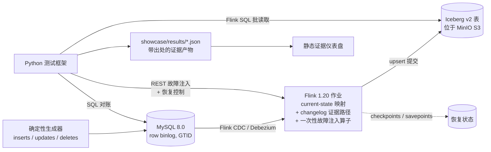

[English](README.md) | [简体中文](README.zh-CN.md)

# Exactly Once Stream — MySQL CDC → Flink → Iceberg

[](https://github.com/LucisZhang/exactly-once-drills/actions/workflows/ci.yml)

这是一个单节点的**可靠性实验室**，面向一条实时数据管道：
`MySQL CDC → Flink 1.20 → Apache Iceberg v2（upsert）`。

一个只在顺利路径（happy path）上能跑通的流式演示，无法证明任何关于精确一次
（exactly-once）投递的结论。真实故障发生在任务进程、检查点（checkpoint）、协调器
（coordinator）、保存点（savepoint）和 Sink 提交附近——因此本实验室**有意注入这些故障**，
然后提出一个狭窄且可检验的问题：在这次特定的故障与恢复路径之后，MySQL 源端快照、
Iceberg 表快照以及 changelog 事件 ID 集合是否仍然逐行一致？每一项声明都由已提交、
可机器校验的 JSON 证据产物支撑，并带有完整出处信息（`run_id`、`git_sha`、确切命令、日志）。

## 核心架构



## 已验证的声明

声明采用**门禁式（gated）**规则：只有当证明某项声明的阶段通过、并在
[`showcase/results/`](showcase/results/) 下产出可审计的 JSON 之后，该声明才会被加入
[`docs/resume-claims-after-verification.md`](docs/resume-claims-after-verification.md)。

| 声明 | 证据 |
| --- | --- |
| 跨**五类受控注入故障**的精确一次最终状态对账——任务崩溃、保留检查点恢复、JobManager 重启、保存点恢复，以及确定性的检查点完成时 Sink 提交故障——每一类均实现**零快照差异与一致的事件 ID 审计**。 | [`showcase/results/eo_reconciliation.json`](showcase/results/eo_reconciliation.json)（运行 `20260711T035242Z-b518d211`），事件记录见 [`RUNBOOK.md`](RUNBOOK.md) |
| CDC 正确性冒烟测试：源端与 Iceberg 最终状态一致（含更新与删除）、changelog 审计计数，以及 equality-delete 文件元数据证据。 | [`showcase/results/phase-1.2-cdc-smoke.json`](showcase/results/phase-1.2-cdc-smoke.json) |
| Iceberg 小文件治理：`rewrite_data_files` + manifest 重写将 **48 个数据文件合并为 2 个**，计划扫描任务数从 48 降至 2，文件大小中位数从 2,809 提升至 6,614.5 字节，并在七次重复测量中将实测 `planFiles()` 延迟从 54.92 ms 降至 44.57 ms。 | [`showcase/results/iceberg_small_file_rewrite.json`](showcase/results/iceberg_small_file_rewrite.json)，图表见 [`showcase/media/`](showcase/media/) |
| 负载下的检查点行为：真实 Prometheus reporter 指标显示，在确定性输入突增下，最大检查点耗时从 **55 ms 升至 19,022 ms**，最大对齐时间从约 5 ms 升至 16,882 ms，记录到一次检查点失败，出现反压，Iceberg 提交滞后增长至 **320 个事件并恢复至零**。 | [`showcase/results/checkpoint_metrics.json`](showcase/results/checkpoint_metrics.json)，图表见 [`showcase/media/`](showcase/media/) |
| Broker 入口一致性：保留的 Path A 与 Kafka Path B 运行相同的 1,000-event、seed-17 工作负载，最终 Iceberg 快照摘要一致，逐行差异为 `0`；Path B offset 的 lag 为 `0`，并与 completed Flink checkpoint 和 Iceberg snapshot ID 关联。 | [`showcase/results/broker_parity.json`](showcase/results/broker_parity.json)（运行 `20260820T102311Z-5bbec087`），原始日志见 [`showcase/logs/phase-b1-broker-verify-20260820T101332Z.log`](showcase/logs/phase-b1-broker-verify-20260820T101332Z.log) |
| Kafka Path B 故障演练：broker 重启从已提交 offset 恢复；强制重投产生 36 次可审计重复但每个 key 最终只保留一行；正确 key 保持分区内顺序，受控错误 key 暴露一次顺序违规；一条 poison record 进入 DLQ 后经修复重放；offset-zero 与 timestamp 全新重建均匹配原快照。所有认证对账的逐行差异均为 `0`。 | [`broker_restart_drill.json`](showcase/results/broker_restart_drill.json)、[`duplicate_redelivery_drill.json`](showcase/results/duplicate_redelivery_drill.json)、[`ordering_miskey_drill.json`](showcase/results/ordering_miskey_drill.json)、[`poison_dlq_drill.json`](showcase/results/poison_dlq_drill.json)、[`offset_replay_drill.json`](showcase/results/offset_replay_drill.json)，事件记录见 [`RUNBOOK.md`](RUNBOOK.md) |

**规模诚实声明。** 这是正确性实验室，不是吞吐量基准。基础路径的已记录故障用例有意保持在
可穷举对账的规模，broker 证据也只覆盖上面明确写出的有界工作负载。本项目没有生产吞吐量、
TB 级大表、长时间运行、跨云、恢复时间、freshness 或可用性 SLO 结论。

## 当前已记录运行

`20260711T034018Z-local-mac`（证据提交 `7eab9c3`）是一次已记录的 Apple Silicon
macOS 运行。主机内存为 16 GiB，Docker Desktop 虚拟机报告 10 个 CPU 和约
7.65 GiB 内存。五类故障全部恢复，快照差异为零，事件 ID 审计一致。

| 故障类型 | 已记录结果 | 主要文件 |
| --- | --- | --- |
| 任务崩溃 | 通过 | [`eo_reconciliation-all.json`](docs/workstation-run/20260711T034018Z-local-mac/eo_reconciliation-all.json) |
| 检查点恢复 | 通过 | 同一 JSON 的 `results[1]` |
| JobManager 重启 | 通过 | 同一 JSON 的 `results[2]` |
| 保存点恢复 | 通过 | 同一 JSON 的 `results[3]` |
| Sink 提交故障 | 通过 | 同一 JSON 的 `results[4]` |

完整命令、环境与清理记录见[运行摘要](docs/workstation-run/20260711T034018Z-local-mac/SUMMARY.md)。
这证明的是这一次已记录的运行，不代表所有硬件都兼容，也不代表任何环境都能一键复现。

## Path A / Path B 架构


- **Path A（保留）**：MySQL GTID/binlog → 内嵌 Debezium 的现有 Flink CDC job →
  Flink checkpoint state → Iceberg v2 keyed upsert；既有 job 和认证故障证据保持不变。
- **Path B（Phase B1）**：MySQL GTID/binlog → 单 worker Debezium Connect
  （at-least-once）→ Kafka 3.9.2 offsets → 独立 Flink Kafka-source job
  （checkpointed source state）→ 同一 Iceberg v2 keyed upsert 模型。

Kafka record key 是 MySQL 主键 `order_id`。因此 Kafka 能保持同一 key 在其 topic
partition 内的顺序，但不保证跨 key 或跨 partition 的全局顺序；错误 key 会落在该保证之外。
Phase B1 verifier 把已提交的分区 offset、completed Flink checkpoint ID 与当前 Iceberg
snapshot ID 记录为同一个 linkage object。认证链接与逐行对账见
[`showcase/results/broker_parity.json`](showcase/results/broker_parity.json)。

Phase B2 已把 Debezium key/value producer 和 Flink Path B consumer 切换为 Schema
Registry 7.9.8 管理的 Avro；B1 的 JSON-wire 结果保持不可变。认证运行
`20260820T120104Z-7e40acd6` 中，Registry 对 `event_id long -> string` 变更返回 HTTP
`409`，value subject 仍为版本 `1`；旧 schema 流水线继续运行，checkpoint 从 `5` 前进到
`7`，Kafka lag 为 `0`，拒绝后的事件可见，最终 source/Iceberg 逐行差异为 `0`。证据见
[`showcase/results/schema_contract_drill.json`](showcase/results/schema_contract_drill.json)，
契约边界见 [`docs/data-contracts.md`](docs/data-contracts.md)。

Phase B3 已在专用 CPU-only Linux VM 上完成五类 broker 故障认证：Kafka 重启后，同一个
Flink job 从已提交 offset 恢复，最终分区 offset 为 `35/35/50`、lag 为 `0`、120 行逐行差异为
`0`；强制重投产生 36 次可审计重复，changelog 从 36 行增至 72 行，而 keyed current 表仍为
36 行；正确主键保持同分区 `0,1,2` 顺序，三个受控错误 key 跨越三个分区并在进入主 topic 前
暴露一次非单调转移；一条 poison record 被隔离到 DLQ，携带原始字节与错误元数据，经注册
Avro schema ID `2` 修复重放后以 14 行、差异 `0` 收敛；offset 0 与指定时间戳的两次全新重建
都与原快照逐行一致，并得到同一摘要
`17ed71ec943ec3a57a8635ba90ab6e2bcae0a7a3db34c146adc6c8b36305487e`。这些是单节点已记录
运行的正确性结论，不是恢复时间、freshness 或吞吐 SLO；后者仍属于 Phase B4。五份证据已在
上方声明表中链接，操作事件见 [`RUNBOOK.md`](RUNBOOK.md)。

## 证据的工作方式

- **正确性安全的读取方式。** Iceberg v2 upsert 表包含 equality delete；pyiceberg 不是这类表的
  正确性读取器。`make sql-iceberg` 通过 **Flink SQL 批模式**读取数据；
  `make sql-iceberg-meta` 使用 pyiceberg，且**仅用于元数据**（文件、manifest、快照）。
- **结果契约。** 每个证据产物必须携带 `run_id`、`git_sha`、`started_at`、`finished_at`、
  `stack_versions`、`command` 和 `logs`（见[契约](showcase/results/README.md)）；
  仪表盘同步步骤会在产物发布前校验该契约。
- **事件日志。** [`RUNBOOK.md`](RUNBOOK.md) 记录每次注入故障的触发方式、症状、
  检测/恢复命令、验证过程与证据链接。

## 证据仪表盘（可部署的部分）

重负载管道不是公开在线演示。可部署部分是基于导出结果 JSON 构建的**静态仪表盘**
（[`dashboard/`](dashboard/)）；它只渲染证据产物及其出处信息，不调用任何后端。

```bash
make dashboard-build     # 校验结果契约，然后执行 Vite 构建
make dashboard-preview   # 在本地启动构建好的仪表盘
```


公开的 [Portfolio Phase 2 Review](https://portfolio-site-gpt-review.vercel.app/engineering/p1-reliability-lab)
提供基于同一 JSON 包的交互式已记录运行回放；隔离的 Review 部署无需 Vercel 登录或查询密钥。

## 本地轻量模式

空间有限的笔记本不启动 Docker，只运行：

```bash
make local-verify
```

该命令执行 harness 单元测试、lint/类型检查、Maven 验证，以及带结果契约校验的静态仪表盘
构建。这是评审项目时推荐的本地命令，但**不会**按需复现真实的 Flink/MySQL/Iceberg 故障运行。

## 远端重负载复现路径

固定工具链为 Java 11（Temurin）、Maven 3.9、Python 3.11 和 Node 20
（见 [`docs/version-matrix.md`](docs/version-matrix.md) 与 `.tool-versions`）。
Mac 只负责轻量检查与证据提交；Docker 运行在专用 Linux VM。任何 `.git`、`.env`、
SSH agent、token 或 Git credential 都不会同步。

```bash
export P1_REMOTE_ROOT='exactly-once-workstation:/root/autodl-tmp/exactly-once-drills'
make sync-up P1_REMOTE_ROOT="$P1_REMOTE_ROOT"
make remote-broker-up P1_REMOTE_ROOT="$P1_REMOTE_ROOT" \
  ARGS="--phase failures --fresh"
make remote-broker-verify P1_REMOTE_ROOT="$P1_REMOTE_ROOT" \
  ARGS="--failure broker-restart"
make sync-down P1_REMOTE_ROOT="$P1_REMOTE_ROOT"
```

其余 B3 名称为 `duplicate-redelivery`、`mis-keying`、`poison-dlq`、`offset-replay`。
远端包装器记录 load average 与 GPU 状态，并用 tmux 保证 SSH 断连不终止长任务。
`make preflight-broker` 还检查磁盘、Docker，以及至少 16 GiB 总内存 / 8 GiB 可用内存。
完整步骤见 [`docs/broker-remote-execution.md`](docs/broker-remote-execution.md)。

重负载路径需要至少 40 GiB 可用磁盘以及足以运行 Flink、MySQL、MinIO 与 Iceberg catalog
的 Docker 内存。仓库卷可用空间低于 25 GiB 或 Docker 无响应时，Makefile 会拒绝启动重任务。
笔记本与工作站的完整职责划分见
[`docs/local-lite-and-workstation.md`](docs/local-lite-and-workstation.md)。

无需 Docker 的轻量检查包括 `make test`、`make lint`、`make dashboard-build`，
以及组合命令 `make local-verify`。

## CI

GitHub Actions 在每次推送时运行轻量路径：Python lint + 单元测试、Flink job Maven 构建，
以及带结果契约校验的仪表盘构建。重负载 Docker 集成（`make eo-verify`、`make test-cdc`）
被有意排除在 CI 之外；它在单节点上人工执行，输出以可审计证据产物提交。

## 范围与状态

- 已验证至 **Phase 2.3**，并完成 **Phase B1 broker ingress parity**、
  **Phase B2 data contracts** 与 **Phase B3 broker failure drills**。B1 以
  [`showcase/results/broker_parity.json`](showcase/results/broker_parity.json) 为边界；
  B2 以 [`showcase/results/schema_contract_drill.json`](showcase/results/schema_contract_drill.json)
  中的 Registry 拒绝与旧 schema 连续流为边界；B3 只以本页链接的五份故障 JSON 为边界。
  它不包含 Phase B4 的恢复时间、freshness 与吞吐 SLO。
- **StarRocks（M3+）尚未启动**；`olap` compose profile、服务表导入和 compaction
  基准测试均为未来工作。
- 仅限单节点 Docker Compose；无云端、无多节点、无 GPU。
- 本地笔记本是证据审阅机器，不是默认重负载复现环境。在作出“可按需复现”声明前，
  必须先保留工作站证据。

## 权利声明

当前未授予任何开源许可证；保留所有权利。Flink、Iceberg、Debezium、MySQL 和 MinIO
各自保留其上游许可证。
